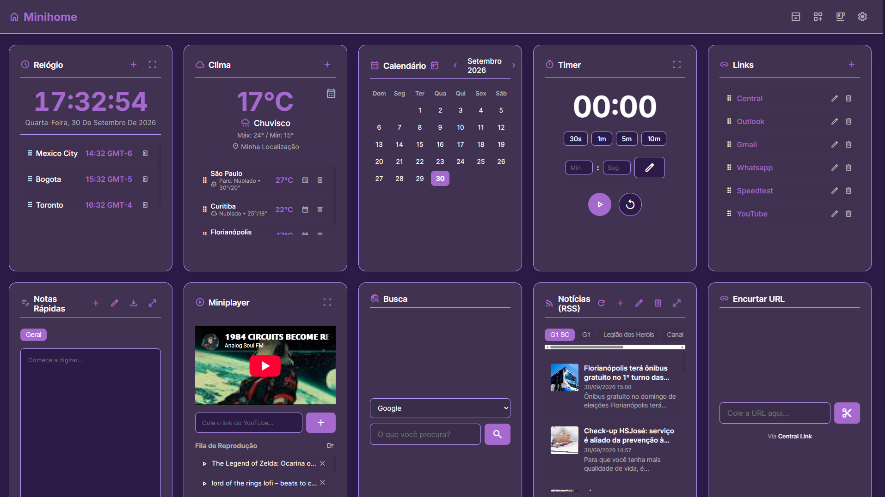

# Minihome

## About

Minihome is a modern, free, open-source dashboard with many useful widgets, designed to have everything you may need in a single place.

It was made with PHP and Javascript, in order to run anywhere you may need.

Customize your dashboard the way you want, move, hide and show widgets, choose one of the prebuilt themes or create one that fit your personality.

## Features

Minihome has the following widgets:

- 🕝 Clock (with world clocks)
- 🌤️ Weather (based on location and on fixed places)
- 📅 Calendar
- ⏱️ Timer
- ⏱️ Stopwatch
- ✅ Todo List
- 📝 Notes
- 🌐 Web Search (using DuckDuckGo, Google and Wikipedia)
- 🔗 Fast Links List
- 🪄 URL Shortener
- 📰 RSS Feeds
- 📺 Video Player for YouTube

Also, choose one of the screensavers for when you are away for a while:

- 🔴 Ball
- 💻 Matrix
- ✨ Stars
- 🌧️ Rain
- 🐍 Snake
- 🖥️ Terminal

Use it at your own language! Minihome has multilanguage support:

- 🇧🇷 Portuguese
- 🇬🇧 English
- 🇪🇸 Spanish

## Using Minihome

Minihome is available at [https://apps.laralabs.dev/minihome](https://apps.laralabs.dev/minihome) or, if you prefer, download the latest release at [releases](https://github.com/laraantunes/minihome/releases/latest) and host it on your own web server.

## External libraries

- Material Icons Font
- OpenWeatherMap API
- Freesound

## Contributing

Just open a PR or an issue and I'll review it! ☺️

## More about me

More projects and info about me at [https://laralabs.dev/](https://laralabs.dev/)
